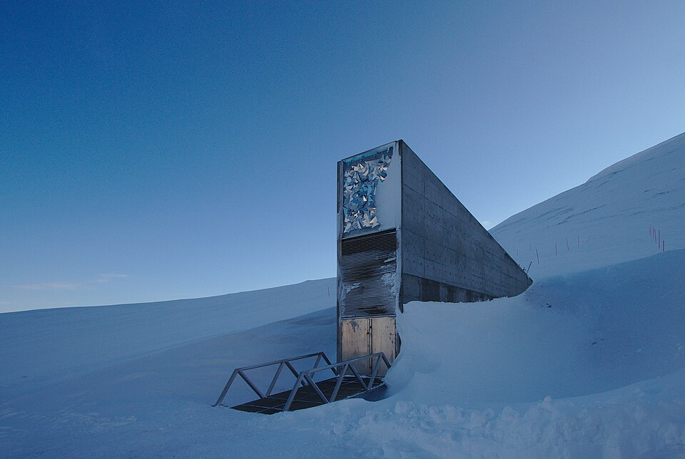

[← Volver al inicio](README.md)

# Temas del curso
Aquí van las entradas de tema: las que propone el profesor a lo largo del curso.
Son de 50 a 100 palabras y llevan una imagen.

**Cada una nueva va debajo de la anterior.**
### 14/09 · Mis aficiones

Llevo en el club de natación de Langreo tres años, aunque el curso  pasado no fui, este año voy a volver para seguir entrenando. 
Lo que más me gusta de nadar es que no pienso en nada más y me permite desconectar de todo, además de que me lo paso muy bien con mis compañeras.
Entreno los martes y jueves, pero no compito porque no me gusta demasiado.

Aunque esa es mi afición principal, también toco el piano y me gusta escuchar música y salir con mis amigos en mi tiempo libre

Buscando en Github he encontrado [Swimming Stroke](https://github.com/agvdndor/Swimming-Stroke-Rate-Analysis) , un programa sobre la técnica de natación.

---

### 28/09 · Premios Princesa de Asturias: Bóveda Global de Semillas de Svalbard

La Bóveda Global de Semillas de Svalbard es un banco de semillas que está en la isla de Spitsbergen, que se localiza en un archipiélago noruego. Se inauguró en 2008 y tienen más de mil metros cuadrados; el objetivo principal es tener unos almacenes para guardar semillas de cultivos por si en un futuro ocurre algún desastre sea natural o sea algún conflicto global. Le han dado a esta estructura el Premio Princesa de Asturias a la Cooperación Internacional 2026 por estas razones; ya que además de contribuir a un futuro mejor para todos aquellos que tengan problemas relacionados con la abundancia de alimentos, también contribuye a conservar diferentes alimentos.
Yo lo he escogido porque me parece muy interesante y útil en muchos aspectos.
[Página web bóveda semillas](https://www.fpa.es/es/premios-princesa-de-asturias/premiados/2026-boveda-global-de-semillas-svalbard/)

Imagen: Einar Jørgen Haraldseid, [Wikimedia Commons](https://commons.wikimedia.org/wiki/File:Svalbard_seed_vault.jpg)

---
